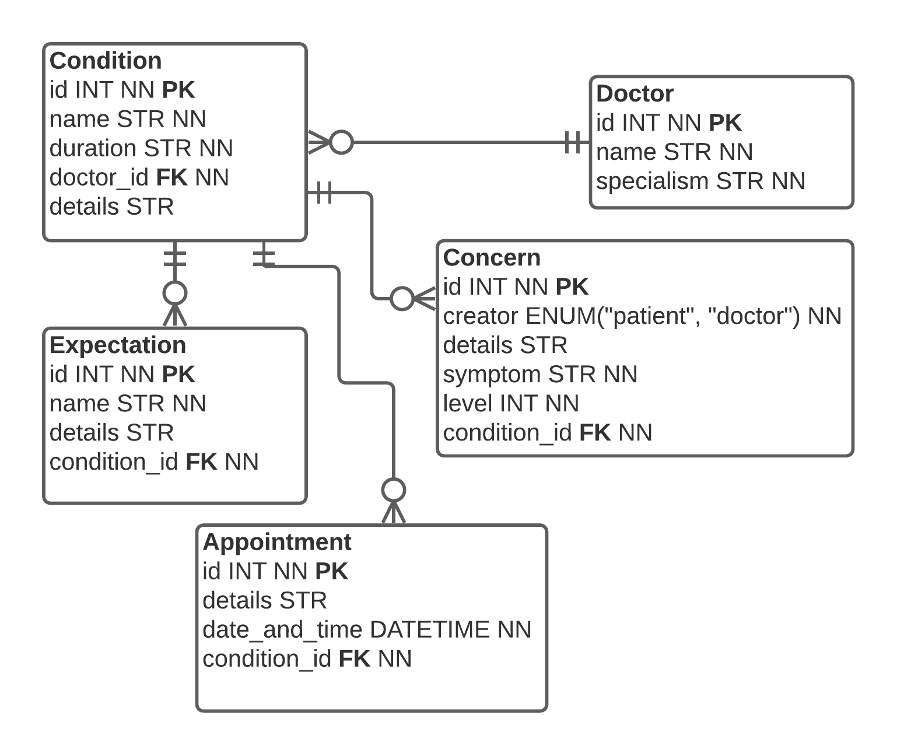

# Let's Talk
Simple full-stack application for arranging appointments
for doctors.

Technically just a demonstration of Python (FastAPI + SQLAlchemy) on the back-end and Vue.JS on the front-end.

Author: David Salac, 2021

## How to run
1. Create empty folder `dbdata` in infrastructure folder
2. Make sure that your docker-compose and docker are updated.
3. Build local stack using `docker-compose build` command. 
4. Use the `docker-compose up` command.

Access you application on address:
```
http://localhost:8080/
```
This address points to the development Node server.

## Release notes:
Back-end end-point is available on address:
```
http://localhost:8081/
```
## Design
The whole application is a simple full-stack system
around the following data model.


